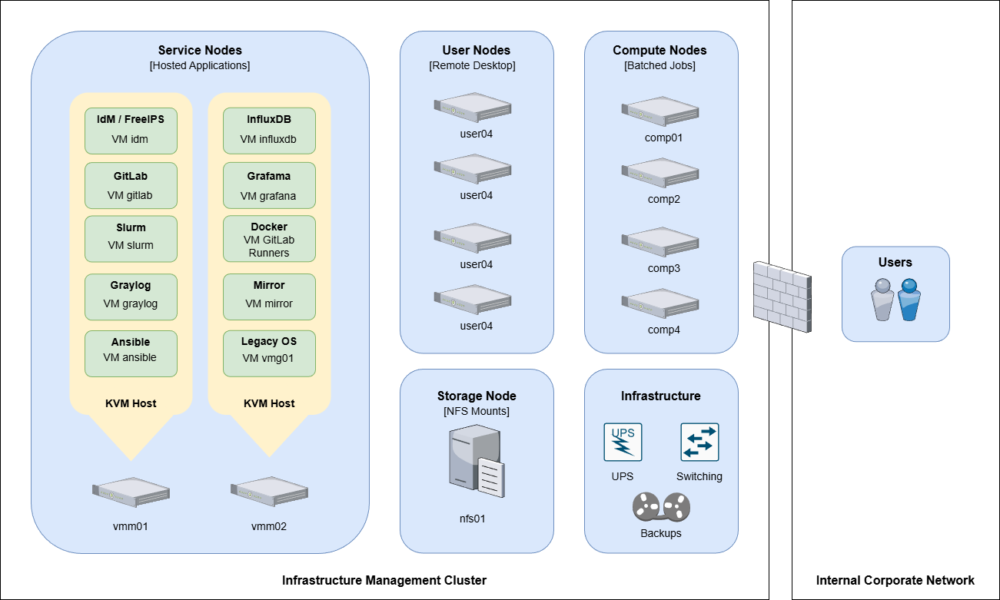

# 1. Cluster Topology

The Cluster Topology shown in Figure 1 illustrates the top-level layout of the Infrastructure Management Cluster. The cluster’s layout generally consists of virtualized systems that host web applications or infrastructure services, and bare-metal systems where high-demand computational workloads are performed. While it is possible to virtualize all systems, bare-metal nodes are recommended for workloads with significant computational or I/O requirements.

A properly configured DNS server that provides a Fully Qualified Domain Name (FQDN) for each system, or alternatively a hosts file that defines the FQDN, is required. Some services (e.g., FreeIPA/IdM) will not function properly without FQDN hostnames being defined.

These guides only cover a simple network and do not address redundant network interfaces, which are recommended for production environments.



## Operating Systems

These guides are written for Red Hat Enterprise Linux 8–based operating systems and are compatible with AlmaLinux 8 and Rocky Linux 8. Any OS-specific differences are noted where required.

## Hostnames

These guides use the following hostname and IPv4 address mappings as examples, which should be adapted for your production environment.

Here's an example /etc/hosts file.

```json title="hosts"
127.0.0.1   localhost localhost.localdomain localhost4 localhost4.localdomain4
::1         localhost localhost.localdomain localhost6 localhost6.localdomain6

10.33.99.150    nfs01.nestodiaz.com        nfs01
10.33.99.151    vmm01.nestodiaz.com        vmm01
10.33.99.152    vmm02.nestodiaz.com        vmm02

10.33.99.160    user01.nestodiaz.com       user01
10.33.99.161    user02.nestodiaz.com       user02
10.33.99.162    user03.nestodiaz.com       user03
10.33.99.163    user04.nestodiaz.com       user04
10.33.99.164    comp01.nestodiaz.com       comp01
10.33.99.165    comp02.nestodiaz.com       comp02
10.33.99.166    comp03.nestodiaz.com       comp03
10.33.99.167    comp04.nestodiaz.com       comp04

10.33.99.180    idm.nestodiaz.com          idm
10.33.99.181    gitlab.nestodiaz.com       gitlab
10.33.99.182    slurm.nestodiaz.com        slurm
10.33.99.183    graylog.nestodiaz.com      graylog
10.33.99.184    ansible.nestodiaz.com      ansible
10.33.99.185    influxdb.nestodiaz.com     influxdb
10.33.99.186    grafana.nestodiaz.com      grafana
10.33.99.187    docker.nestodiaz.com       docker
10.33.99.188    mirror.nestodiaz.com       mirror
10.33.99.189    vmg01.nestodiaz.com        vmg01
```
