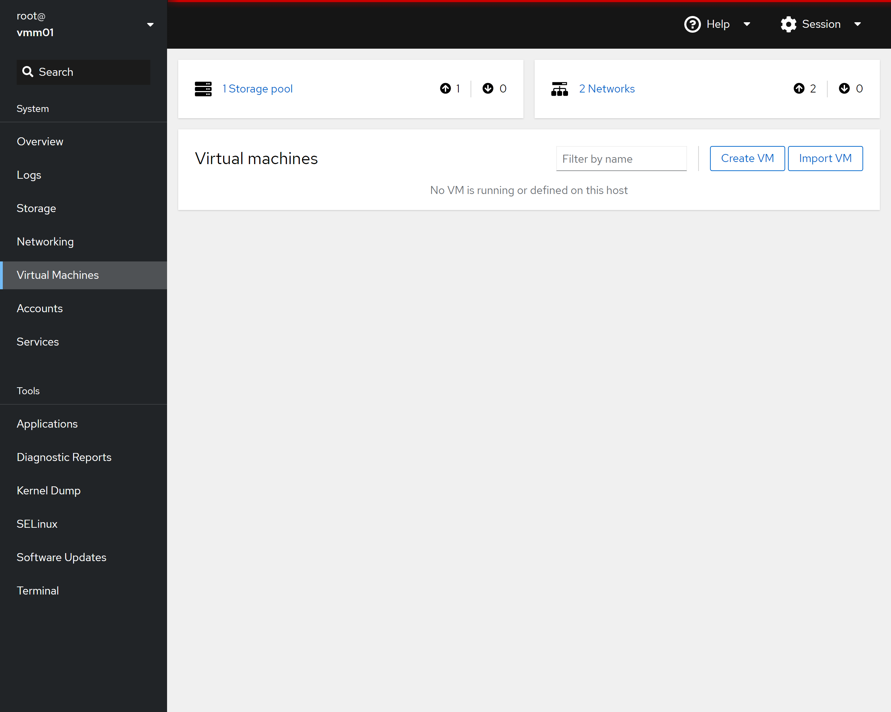
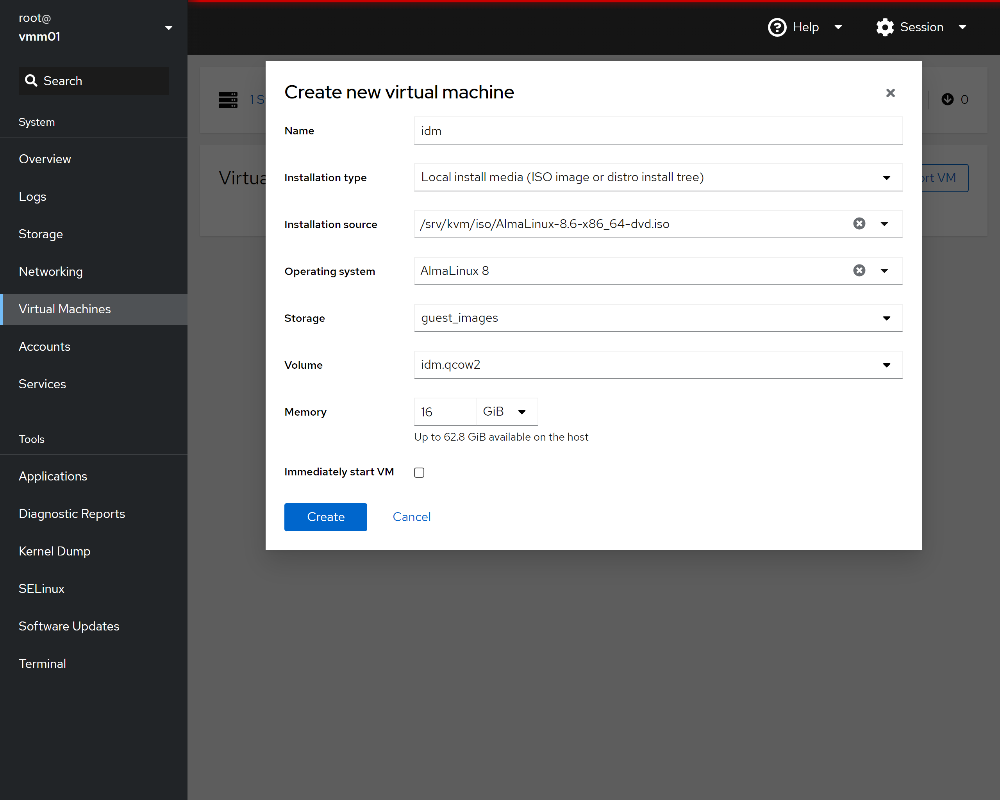
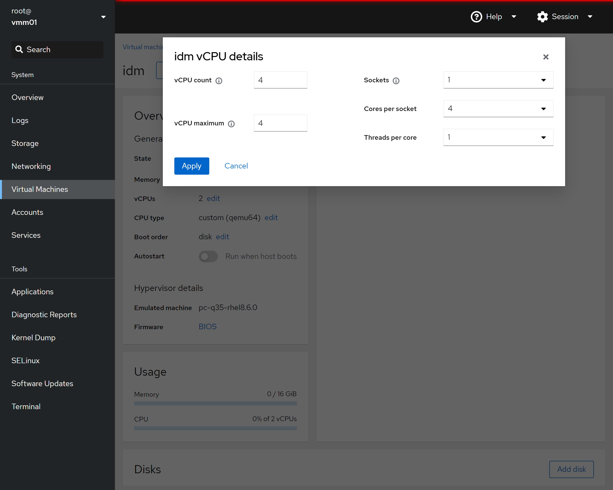
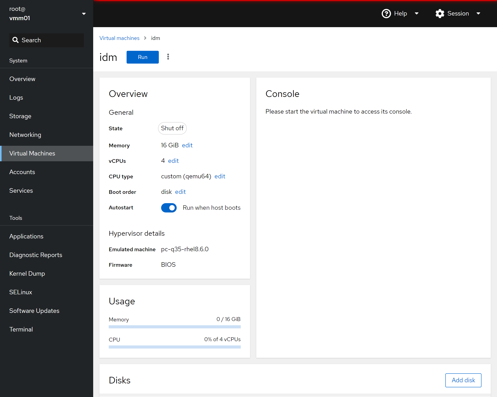

# 3. Virtual Machine Manager Deployment

The following instructions are for configuring the Virtual Machine Managers.

## Prerequisites

This guide is written for a Red Hat Enterprise Linux 8 based operating system which is operating within a cluster of systems and the following are the prerequisites:

- [Virtual Machine Manager OS Installation](/docs/infra_mgmt_cluster/2-0-vmm-install)

## Post Deployment

>```json
>The Cockpit Management Web Interface can be accessed at the following URLs:
>Virtual Machine Manager 1: https://vmm01.nestodiaz.com:9090
>Virtual Machine Manager 2: https://vmm02.nestodiaz.com:9090
>```

## Deployment Scripts

>```json
>Username: root
>Password: ROOT_PASSWORD
>```

<details>
    <summary>deploy-vmm01.sh</summary>

```json
#!/bin/bash
###############################################################################
#
#   Filename: deploy-vmm01.sh
#
#   Functional Description:
#
#       Bash script which deploys Virtual Machine Manager 1.
#
#   Usage:
#
#       ./deploy-vmm01.sh
#
###############################################################################

### Ensure running as root
if [ "$EUID" -ne 0 ]; then
  echo -e "ERROR: Please run as root\n"
  exit
fi

echo -e "\n[$(date +"%Y-%m-%d %H:%M:%S")] Deploying Virtual Machine Manager 1...\n"


###############################################################################
# Required Configuration Options
###############################################################################

# Bridge Configuration
ETHERNET_INTERFACE="eno1"
BRIDGE_NAME="vmbr0"

# VMM IPv4 Address
IP_ADDRESS="192.168.1.51"

# DNS Server
IP_DNS="192.168.1.1"

# IPv4 Gateway
IP_GATEWAY="192.168.1.1"


###############################################################################
# Installation Commands
###############################################################################

# Update System
dnf -y upgrade

# Install RPM Packages
dnf -y install tar openssl-devel cockpit cockpit-packagekit \
  cockpit-pcp cockpit-storaged cockpit-system cockpit-ws \
  cockpit-machines qemu-kvm qemu-kvm-block-iscsi \
  qemu-kvm-block-curl qemu-kvm-common qemu-kvm-block-ssh \
  qemu-kvm-block-iscsi lm_sensors lm_sensors-devel lm_sensors-libs \
  virt-install libosinfo

# Enable Cockpit
systemctl enable --now cockpit.socket
firewall-cmd --zone=public --add-service=cockpit --permanent
systemctl reload firewalld


# Configure KVM

# Create KVM Directories
mkdir -p /srv/kvm
mkdir    /srv/kvm/iso
mkdir    /srv/kvm/img
mkdir    /srv/tmp

# Create guest_images storage pool
virsh pool-define-as "guest_images" dir - - - - "/srv/kvm/img/"
virsh pool-build 'guest_images'
virsh pool-start 'guest_images'
virsh pool-autostart 'guest_images'

# Create storage volumes
GUEST_IMAGE_PATH="/srv/kvm/img"
qemu-img create -f qcow2 -o preallocation=off ${GUEST_IMAGE_PATH}/idm.qcow2     96G
qemu-img create -f qcow2 -o preallocation=off ${GUEST_IMAGE_PATH}/gitlab.qcow2  2T
qemu-img create -f qcow2 -o preallocation=off ${GUEST_IMAGE_PATH}/slurm.qcow2   96G
qemu-img create -f qcow2 -o preallocation=off ${GUEST_IMAGE_PATH}/graylog.qcow2 96G
qemu-img create -f qcow2 -o preallocation=off ${GUEST_IMAGE_PATH}/ansible.qcow2 96G


# Create Virtual Machine Bridge

# List Interfaces
ip addr

# List Active Network Connections
nmcli conn show

# Create a bridge interface
nmcli connection add type bridge con-name ${BRIDGE_NAME} ifname ${BRIDGE_NAME}

# Add static IP address
nmcli conn modify ${BRIDGE_NAME} ipv4.addresses "${IP_ADDRESS}/24"
nmcli conn modify ${BRIDGE_NAME} ipv4.gateway "${IP_GATEWAY}"
nmcli conn modify ${BRIDGE_NAME} ipv4.dns "${IP_DNS}"
nmcli conn modify ${BRIDGE_NAME} ipv4.method manual

# Assign the interfaces to the bridge
nmcli connection add type ethernet slave-type bridge autoconnect yes \
    con-name bridge-${BRIDGE_NAME} ifname ${ETHERNET_INTERFACE} master ${BRIDGE_NAME}

# Bring up or activate the bridge connection
nmcli conn up ${BRIDGE_NAME}

# Bring down wired connection
nmcli conn down ${ETHERNET_INTERFACE}

# Display the network interfaces
nmcli device status

# List Interfaces
ip addr

# Show Bridge Details
nmcli -f bridge con show ${BRIDGE_NAME}

# Declaring the KVM Bridged Network
virsh net-list --all

cat << 'EOL' > /tmp/bridge.xml
<network>
  <name>vmbr0</name>
  <forward mode="bridge"/>
  <bridge name="vmbr0"/>
</network>
EOL

virsh net-define /tmp/bridge.xml
virsh net-start ${BRIDGE_NAME}
virsh net-autostart ${BRIDGE_NAME}

# Suppress Negotiate Headers
cat >> /etc/cockpit/cockpit.conf <<EOF
[gssapi]
action = none

[negotiate]
action = none
EOF

echo -e "\n[$(date +"%Y-%m-%d %H:%M:%S")] Deploying Virtual Machine Manager 1 Complete\n"
exit 0

```

</details>

<details>
    <summary>deploy-vmm02.sh</summary>

```json
#!/bin/bash
###############################################################################
#
#   Filename: deploy-vmm02.sh
#
#   Functional Description:
#
#       Bash script which deploys Virtual Machine Manager 2.
#
#   Usage:
#
#       ./deploy-vmm02.sh
#
###############################################################################

### Ensure running as root
if [ "$EUID" -ne 0 ]; then
  echo -e "ERROR: Please run as root\n"
  exit
fi

echo -e "\n[$(date +"%Y-%m-%d %H:%M:%S")] Deploying Virtual Machine Manager 2...\n"


###############################################################################
# Required Configuration Options
###############################################################################

# Bridge Configuration
ETHERNET_INTERFACE="eno1"
BRIDGE_NAME="vmbr0"

# VMM IPv4 Address
IP_ADDRESS="192.168.1.52"

# DNS Server
IP_DNS="192.168.1.1"

# IPv4 Gateway
IP_GATEWAY="192.168.1.1"


###############################################################################
# Installation Commands
###############################################################################

# Update System
dnf -y upgrade

# Install RPM Packages
dnf -y install tar openssl-devel cockpit cockpit-packagekit \
  cockpit-pcp cockpit-storaged cockpit-system cockpit-ws \
  cockpit-machines qemu-kvm qemu-kvm-block-iscsi \
  qemu-kvm-block-curl qemu-kvm-common qemu-kvm-block-ssh \
  qemu-kvm-block-iscsi lm_sensors lm_sensors-devel lm_sensors-libs \
  virt-install libosinfo

# Enable Cockpit
systemctl enable --now cockpit.socket
firewall-cmd --zone=public --add-service=cockpit --permanent
systemctl reload firewalld


# Configure KVM

# Create KVM Directories
mkdir -p /srv/kvm
mkdir    /srv/kvm/iso
mkdir    /srv/kvm/img
mkdir    /srv/tmp

# Create guest_images storage pool
virsh pool-define-as "guest_images" dir - - - - "/srv/kvm/img/"
virsh pool-build 'guest_images'
virsh pool-start 'guest_images'
virsh pool-autostart 'guest_images'

# Create storage volumes
GUEST_IMAGE_PATH="/srv/kvm/img"
qemu-img create -f qcow2 -o preallocation=off ${GUEST_IMAGE_PATH}/indfuxdb.qcow2 96G
qemu-img create -f qcow2 -o preallocation=off ${GUEST_IMAGE_PATH}/grafana.qcow2  96G
qemu-img create -f qcow2 -o preallocation=off ${GUEST_IMAGE_PATH}/docker.qcow2   2T
qemu-img create -f qcow2 -o preallocation=off ${GUEST_IMAGE_PATH}/icinga.qcow2   96G
qemu-img create -f qcow2 -o preallocation=off ${GUEST_IMAGE_PATH}/legacy.qcow2   96G


# Create Virtual Machine Bridge

# List Interfaces
ip addr

# List Active Network Connections
nmcli conn show

# Create a bridge interface
nmcli connection add type bridge con-name ${BRIDGE_NAME} ifname ${BRIDGE_NAME}

# Add static IP address
nmcli conn modify ${BRIDGE_NAME} ipv4.addresses "${IP_ADDRESS}/24"
nmcli conn modify ${BRIDGE_NAME} ipv4.gateway "${IP_GATEWAY}"
nmcli conn modify ${BRIDGE_NAME} ipv4.dns "${IP_DNS}"
nmcli conn modify ${BRIDGE_NAME} ipv4.method manual

# Assign the interfaces to the bridge
nmcli connection add type ethernet slave-type bridge autoconnect yes \
    con-name bridge-${BRIDGE_NAME} ifname ${ETHERNET_INTERFACE} master ${BRIDGE_NAME}

# Bring up or activate the bridge connection
nmcli conn up ${BRIDGE_NAME}

# Bring down wired connection
nmcli conn down ${ETHERNET_INTERFACE}

# Display the network interfaces
nmcli device status

# List Interfaces
ip addr

# Show Bridge Details
nmcli -f bridge con show ${BRIDGE_NAME}

# Declaring the KVM Bridged Network
virsh net-list --all

cat << 'EOL' > /tmp/bridge.xml
<network>
  <name>vmbr0</name>
  <forward mode="bridge"/>
  <bridge name="vmbr0"/>
</network>
EOL

virsh net-define /tmp/bridge.xml
virsh net-start ${BRIDGE_NAME}
virsh net-autostart ${BRIDGE_NAME}

# Suppress Negotiate Headers
cat >> /etc/cockpit/cockpit.conf <<EOF
[gssapi]
action = none

[negotiate]
action = none
EOF

echo -e "\n[$(date +"%Y-%m-%d %H:%M:%S")] Deploying Virtual Machine Manager 2 Complete\n"
exit 0

```

</details>

## Deployment Steps

:::note

Instructions assume execution using the `root` account.

:::

>1. Install dependencies:
>
>```json
>dnf -y install tar openssl-devel cockpit cockpit-packagekit \
>    cockpit-pcp cockpit-storaged cockpit-system cockpit-ws \
>    cockpit-machines qemu-kvm qemu-kvm-block-iscsi \
>    qemu-kvm-block-curl qemu-kvm-common qemu-kvm-block-ssh \
>    qemu-kvm-block-iscsi lm_sensors lm_sensors-devel lm_sensors-libs \
>    virt-install libosinfo
>```

>2. Enable Cockpit:
>
>```yaml
>systemctl enable --now cockpit.socket
>firewall-cmd --zone=public --add-service=cockpit --permanent
>systemctl reload firewalld
>```

>3. Create guest_images storage pool:
>
>```yaml
># Create KVM directories
>mkdir -p /srv/kvm
>mkdir    /srv/kvm/iso
>mkdir    /srv/kvm/img
>mkdir    /srv/tmp
>
># Create pools
>virsh pool-define-as "guest_images" dir - - - - "/srv/kvm/img/"
>virsh pool-build 'guest_images'
>virsh pool-start 'guest_images'
>virsh pool-autostart 'guest_images'
>```

>4. Create storage volumes:
>
>```json title="Virtual Machine Manager 1"
>qemu-img create -f qcow2 -o preallocation=off /srv/kvm/img/idm.qcow2     96G
>qemu-img create -f qcow2 -o preallocation=off /srv/kvm/img/gitlab.qcow2  2T
>qemu-img create -f qcow2 -o preallocation=off /srv/kvm/img/slurm.qcow2   96G
>qemu-img create -f qcow2 -o preallocation=off /srv/kvm/img/graylog.qcow2 96G
>qemu-img create -f qcow2 -o preallocation=off /srv/kvm/img/ansible.qcow2 96G
>```
>
>```json title="Virtual Machine Manager 2"
>qemu-img create -f qcow2 -o preallocation=off /srv/kvm/img/indfuxdb.qcow2 96G
>qemu-img create -f qcow2 -o preallocation=off /srv/kvm/img/grafana.qcow2  96G
>qemu-img create -f qcow2 -o preallocation=off /srv/kvm/img/docker.qcow2   2T
>qemu-img create -f qcow2 -o preallocation=off /srv/kvm/img/mirror.qcow2   96G
>qemu-img create -f qcow2 -o preallocation=off /srv/kvm/img/vmg01.qcow2    96G
>```

>5. Create Virtual Machine Bridge:
>
>:::important
>
>Verify the name of the ethernet interface and the IPv4 address. The interface name may be different than “eno1” and the IPv4 addresses should be the value for your environment.
>
>:::
>
>For Virtual Machine Manager 1:
>
>```json
>IP_ADDRESS="10.33.99.151"
>```
>
>For Virtual Machine Manager 2:
>
>```json
>IP_ADDRESS="10.33.99.152"
>```
>
>For both Virtual Machine Manager 1 and Virtual Machine Manager 2:
>
>```yaml
># Bridge Configuration
>ETHERNET_INTERFACE="eno1"
>BRIDGE_NAME="vmbr0"
>IP_DNS="192.168.1.1"
>IP_GATEWAY="192.168.1.1"
>
># (Informational Only) List Interfaces
>ip addr
>
># (Informational Only) List Active Network Connections
>nmcli conn show
>
># Create a bridge interface
>nmcli connection add type bridge con-name ${BRIDGE_NAME} ifname ${BRIDGE_NAME}
>
># Add static IP address
>nmcli conn modify ${BRIDGE_NAME} ipv4.addresses "${IP_ADDRESS}/24"
>nmcli conn modify ${BRIDGE_NAME} ipv4.gateway "${IP_GATEWAY}"
>nmcli conn modify ${BRIDGE_NAME} ipv4.dns "${IP_DNS}"
>nmcli conn modify ${BRIDGE_NAME} ipv4.method manual
>
># Assign the interfaces to the bridge
>nmcli connection add type ethernet slave-type bridge autoconnect yes \
>    con-name bridge-${BRIDGE_NAME} ifname ${ETHERNET_INTERFACE} master ${BRIDGE_NAME}
>
># Bring up or activate the bridge connection
>nmcli conn up ${BRIDGE_NAME}
>
># Bring down wired connection
>nmcli conn down ${ETHERNET_INTERFACE}
>
># (Informational Only) Display the network interfaces
>nmcli device status
>
># (Informational Only) List Interfaces
>ip addr
>
># (Informational Only) Show Bridge Details
>nmcli -f bridge con show ${BRIDGE_NAME}
>
># Declaring the KVM Bridged Network
>virsh net-list --all
>
>cat << 'EOL' > /tmp/bridge.xml
><network>
>  <name>vmbr0</name>
>  <forward mode="bridge"/>
>  <bridge name="vmbr0"/>
></network>
>EOL
>
>virsh net-define /tmp/bridge.xml
>virsh net-start ${BRIDGE_NAME}
>virsh net-autostart ${BRIDGE_NAME}
>```

>6. Upload Guest ISO Images:
>
>:::important
>
>The ISO file name will vary depending OS and version being used.
>
>:::
>
>```json
>scp rhel-8.8-x86_64-dvd.iso root@vmm1.nestodiaz.com:/srv/kvm/iso/rhel-8.8-x86_64-dvd.iso
>scp rhel-8.8-x86_64-dvd.iso root@vmm2.nestodidaz.com:/srv/kvm/iso/rhel-8.8-x86_64-dvd.iso
>```

>7. Suppress Negotiate Headers:
>
>:::note
>
>This is optional and prevents falling back to HTML login boxes in Windows browsers.
>
>:::
>
>```json
>sudo nano /etc/cockpit/cockpit.conf
>```
>
>```json
>[gssapi]
>action = none
>
>[negotiate]
>action = none
>```

>8. Reboot system:
>
>```json
>sudo reboot now
>```

>9. Log into Cockpit:
>
>Virtual Machine Manager 1: https://vmm01.nestodiaz.com:9090
>
>Virtual Machine Manager 2: https://vmm02.nestodiaz.com:9090
>
>

>10. Create the Virtual Machine Guests:
>
>:::info
>
>The next step will be repeated for all VMs hosted by Virtual Machine Manager 01 and Virtual Machine Manager 02 nodes.
>
>:::
>
>```json
>* Click on the "Virtual Machines" link on the left of the page
>```
>
>

>```json
>* Click on the "Create VM" button on the right of the page
>* Provide a name that matches the VM you are creating in all lower case characters
>* In the "Installation type" drop-down select
>  "Local install Media (ISO image or distro install tree)
>* In the "Installation source" drop-down/box add the path to the ISO
>  (ex. /srv/kvm/iso/rhel-8.8-x86_64-dvd.iso)
>* In the "Operating system" drop-down/box add or select "Red Hat Enterprise Linux 8.8 (Ootpa)"
>* In the "Storage" drop-down/box select "guest_images"
>* In the "Volume" box select the appropriate VM guest image file (ex. idm.qcow2)
>* In the "Memory" box select 16 GiB (see guides for the amount but typically it is 16GiB)
>* Verify "Run unattended installation" *IS NOT* checked
>* Verify "Immediately start VM" *IS NOT* checked
>* Click "Create"
>```
>
>

>```json
>* Click on the name of the VM just created
>```
>
>

>```json
>* Click on the "edit" link next to "vCPUs"
>```
>
>

>```json
>* Change "vCPU maximum" to 4
>* Change "vCPU count" to 4
>* Change "Sockets" to 1
>* Change "Cores per socket" to 4
>* Change "Threads per core" to 1
>* Click on "Apply"
>```
>
>

>```json
>* On the Virtual Machine details page...
>* Verify "Run when host boots" is enabled
>* Click on "Install" or "Run" ("Install" is shown on first run)
>```
>
>

>```json
>* Install the VM guest using the other guides
>```
>
>