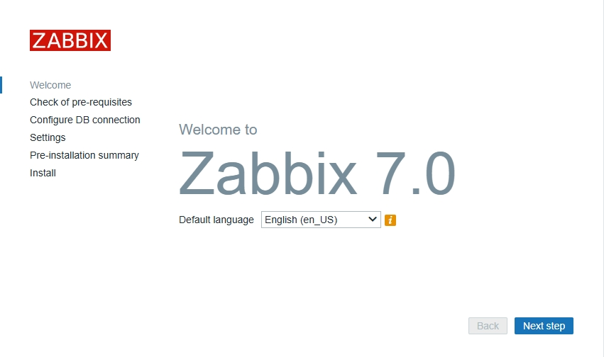
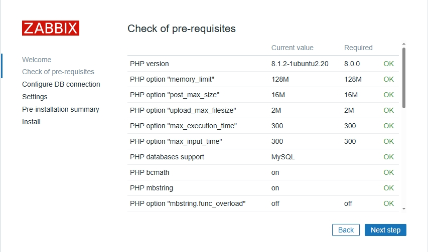
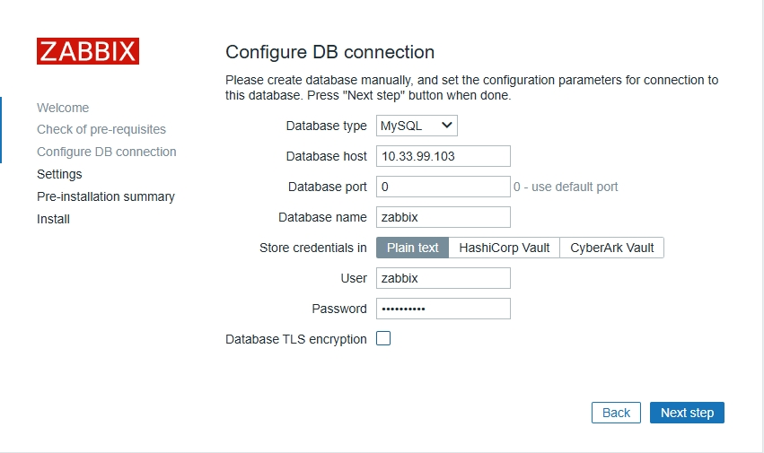
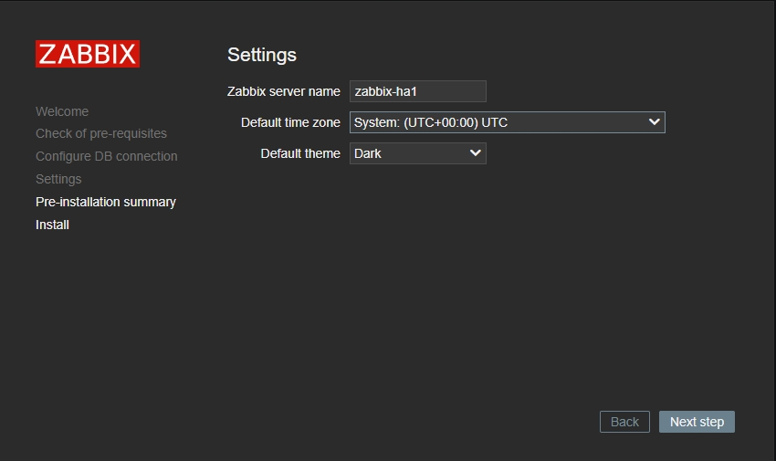
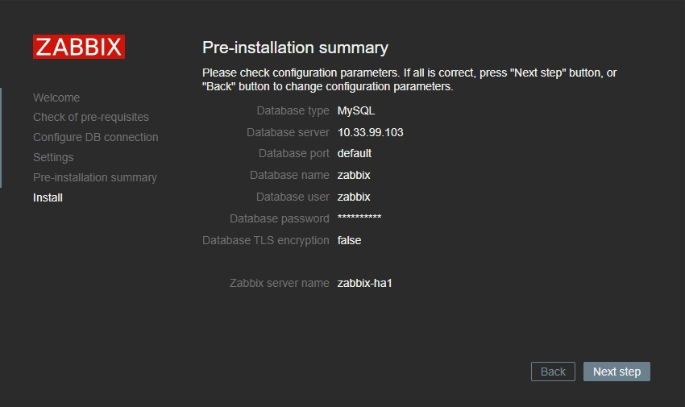
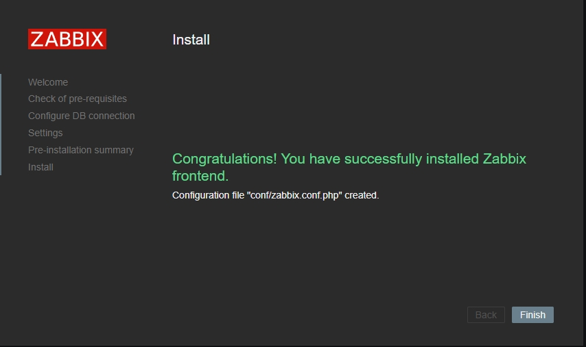
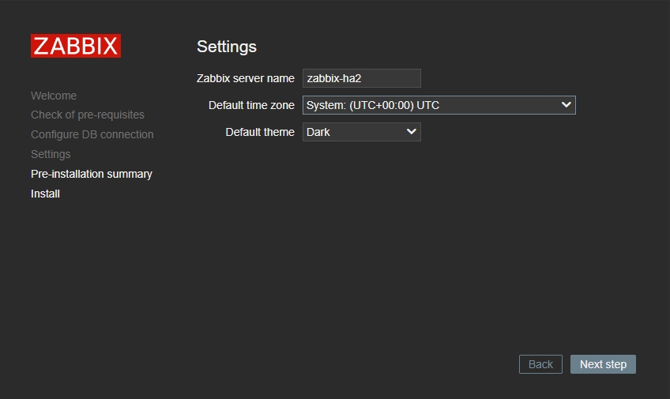

# Configuring High Availability Zabbix

Zabbix is a powerful open-source monitoring solution that can monitor various services, servers, and network devices. In this blog, I will show how I installed the Zabbix server (version 7.0), configured it to use MariaDB as its database, and got it running on Ubuntu 22.04. I will also show how I setup 3 more Zabbix servers to ensure availability.

:::info[Prerequisites]

- 3 Ubunt 22.04 VMs

:::

:::info[My Setup]

import Tabs from '@theme/Tabs';
import TabItem from '@theme/TabItem';

<Tabs>
  <TabItem value="zabbix-ha1" label="Zabbix-HA1" default>
    - Ubuntu 22.04 LTS
    - 10.33.99.101
    - 4 cores
    - 8GB RAM
    - 40GB storage
  </TabItem>
  <TabItem value="zabbix-ha2" label="Zabbix-HA2">
    - Ubuntu 22.04 LTS
    - 10.33.99.102
    - 4 cores
    - 8GB RAM
    - 40GB storage
  </TabItem>
  <TabItem value="zabbix-db1" label="Zabbix-DB1">
    - Ubuntu 22.04 LTS
    - 10.33.99.103
    - 4 cores
    - 8GB RAM
    - 60GB storage
  </TabItem>
</Tabs>

:::

## Installation

### Zabbix-DB1

First, I SSH'd into the server I'll be using as the database.

Then I downloaded the MariaDB repo.

```bash
wget https://downloads.mariadb.com/MariaDB/mariadb_repo_setup
chmod +x mariadb_repo_setup
sudo ./mariadb_repo_setup
```

Then I installed MariaDB, and enabled it to start upon boot.

```bash
sudo apt install mariadb-server
sudo systemctl enable mariadb
sudo systemctl start mariadb
```

:::note[Note]

MariaDB has a script that helps improve security.
You can run the following command and follow the prompts to better secure it.
`sudo mariadb-secure-installation`

:::

Next I logged into MariaDB as root.

```bash
mariadb -u root -p
```

I then created the database and users for zabbix-ha1, zabbix-ha2, and the virtual IP I’ll be setting up later.

```bash
create database zabbix character set utf8mb4 collate utf8mb4_bin;

create user zabbix@'10.33.99.101' identified by 'top_secret_password';
create user zabbix@'10.33.99.102' identified by 'top_secret_password';
create user zabbix@'10.33.99.105' identified by 'top_secret_password';

grant all privileges on zabbix.* to 'zabbix'@'10.33.99.101' identified by 'top_secret_password';
grant all privileges on zabbix.* to 'zabbix'@'10.33.99.102' identified by 'top_secret_password';
grant all privileges on zabbix.* to 'zabbix'@'10.33.99.105' identified by 'top_secret_password';

set global log_bin_trust_function_creators = 1;
quit;
```

:::info[Command Explanation]

- `10.33.99.101` - The IP address of my zabbix-ha1 server.
- `10.33.99.102` - The IP address of my zabbix-ha2 server.
- `10.33.99.105` - The virtual IP address I'll be setting up with Nginx.
- `set global ...` - Temporarily allows creation of functions (required when importing the scheme)

:::

I then installed the Zabbix repository and SQL Scripts, which are used during the installation and configuration of a Zabbix server.

```bash
wget https://repo.zabbix.com/zabbix/7.0/ubuntu/pool/main/z/zabbix-release/zabbix-release_7.0-1+ubuntu22.04_all.deb
sudo dpkg -i zabbix-release_7.0-1+ubuntu22.04_all.deb
sudo apt update
sudo apt install zabbix-sql-scripts
```

Then ran the import.

```bash
zcat /usr/share/zabbix-sql-scripts/mysql/server.sql.gz | mysql --default-character-set=utf8mb4 -u root -p zabbix
```

:::info[Command Explanation]

- `zcat` - Decompresses the Zabbix SQL scheme.
- `| mysql --default ...` - Pipes and imports it into the _zabbix_ database.

:::

After the imported completed I disabled the log_bin trust.

```bash
mysql -u root -p
set global log_bin_trust_function_creators = 0;
quit;
```

### Zabbix-HA1

Zabbix server will be installed on both Zabbix-HA1 and Zabbix-HA2.

First, I downloaded and added the Zabbix 7.0 repository.

```bash
wget https://repo.zabbix.com/zabbix/7.0/ubuntu/pool/main/z/zabbix-release/zabbix-release_7.0-1+ubuntu22.04_all.deb
sudo dpkg -i zabbix-release_7.0-1+ubuntu22.04_all.deb
sudo apt update
```

Then I installed the server package along with MySQL database support.

```bash
sudo apt install zabbix-server-mysql
```

Next, I needed to make some changes to the .conf file.

```bash
sudo nano /etc/zabbix/zabbix_server.conf
```

I found the following lines and filled them out accordingly.

```bash
DBHost=10.33.99.103
DBUser=zabbix
DBPassword=password
```

:::info[Command Explanation]

- `DBHost` - I put the IP address of the zabbix-db1 server.
- `DBUser` - I left it as _zabbix_.
- `DBPassword` - I changed this to the password I setup earlier.

:::

I scrolled to the very bottom of the file and uncommented the following lines.

```bash
HANodeName=zabbix-ha1
NodeAddress=10.33.99.101
```

:::note[Command Explanation]

- `HANodeName` - I put the name of the server (It doesn’t have to be the name of the server but I like to keep consistency).
- `NodeAdress` - The IP address of this server (zabbix-ha1).

:::

Then saved and exited.

### Zabbix-HA2

Now to do the same on Zabbix-HA2 with some minor changes.

Once again I downloaded and added the Zabbix 7.0 repository.

```bash
wget https://repo.zabbix.com/zabbix/7.0/ubuntu/pool/main/z/zabbix-release/zabbix-release_7.0-1+ubuntu22.04_all.deb
sudo dpkg -i zabbix-release_7.0-1+ubuntu22.04_all.deb
sudo apt update
```

Then I installed the server package along with MySQL database support.

```bash
sudo apt install zabbix-server-mysql
```

Next, I needed to make some changes to the .conf file.

```bash
sudo nano /etc/zabbix/zabbix_server.conf
```

I found the following lines and filled them out accordingly.

```bash
DBHost=10.33.99.103
DBUser=zabbix
DBPassword=password
```

:::info[Command Explanation]

- `DBHost` - I put the IP address of the zabbix-db1 server.
- `DBUser` - I left it as _zabbix_.
- `DBPassword` - I changed this to the password I setup earlier.

:::

Here’s where the minor differences are. I scrolled to the very bottom of the file and filled these lines as follows.

```bash
HANodeName=zabbix-ha2
NodeAddress=10.33.99.102
```

:::info[Command Explanation]

- `HANodeName` - I put the name of the server (It doesn’t have to be the name of the server but I like to keep consistency).
- `NodeAddress` - The IP address of this server (zabbix-ha2).

:::

Then I enabled Zabbix to start on boot and to started the service on both ha1 and ha1.

```bash
sudo systemctl enable zabbix-server
sudo systemctl start zabbix-server
```

### Nginx

This will be setup on both ha1 and ha2 servers, again with some minor differences on each.

First, I installed ‘keepalived’ on both servers.

```bash
sudo apt install keepalived
```

Then created the following .conf file on both servers.

```bash
sudo nano /etc/keepalived/keepalived.conf
```

On zabbix-ha1 I configured the conf. file as the master.

```bash
vrrp_track_process chk_nginx {
  process nginx
  weight 10
}

vrrp_instance ZBX_1 {
  state MASTER
  interface ens18
  virtual_router_id 51
  priority 244
  advert_int 1
  authentication {
    auth_type PASS
    auth_pass top_secret_password
  }
  track_process {
    chk_nginx
  }
  virtual_ipaddress {
    10.33.99.105/24
  }
}
```

:::info[Command Explanation]

- `state` – I changed this to MASTER. This node start with higher priority.
- `interface` – I changed this to the name of the server’s interface name.
- `priority` – I changed this to 244.
- `auth_pass` – I entered a secure password.
- `virtual_ipaddress` – The IP address I’m going to use to access Zabbix.

:::

On zabbix-ha2 there’s a few differences.

```bash
vrrp_track_process chk_nginx {
  process nginx
  weight 10
}

vrrp_instance ZBX_1 {
  state BACKUP
  interface ens18
  virtual_router_id 51
  priority 243
  advert_int 1
  authentication {
    auth_type PASS
    auth_pass top_secret_password
  }
  track_process {
    chk_nginx
  }
  virtual_ipaddress {
    10.33.99.105/24
  }
}
```

:::info[Command Explanation]

- `state` – I changed this to BACKUP. This node start with lower priority.
- `interface` – I changed this to the name of the server’s interface name.
- `priority` – I changed this to 243.
- `auth_pass` – I entered a secure password.
- `virtual_ipaddress` – The IP address I’m going to use to access Zabbix.

:::

On both servers I installed the Zabbix frontend.

:::info[Command Explanation]

- `nginx` – Installs the Nginx web server, which will server the Zabbix frontend.
- `zabbix-frontend-conf` – Installs the PHP frontend for Zabbix.
- `zabbix-nginx-conf` – Installs the configuration files needed to set up Zabbix with Nginx.

:::

I then edited the following .conf file on both servers.

```bash
sudo nano /etc/zabbix/nginx.conf
```

I then uncommented the following lines and changed the port and server name (this will be the same on both ha1 and ha2).

```bash
# listen 8080;
# server_name example.com;

listen 80;
server_name 10.33.0.105;
```

Then finally enabled Nginx and keepalived to start on boot, and started the services.

```bash
sudo systemctl enable nginx keepalived
sudo systemctl start nginx keepalived
```

### Frontend

To setup the front end, I’ll have to go through the initial Zabbix configuration twice. The first will be on ha1, then stopping Nginx on ha1, and repeating it for ha2. But, I’ll be doing it from the virtual IP I setup, and not the server’s individual IP addresses.

First, I went to the virtual IP address I configured.

```bash
http://10.33.99.105/
```

First page will be the language select.



I verified everything was ‘OK’.



Then I configured the database connection.



:::info[Info]

- `Database host` – I inputed the IP address of zabbix-db1.
- `Password` – The password I setup for the database in MariaDB.
- `Database` TLS encryption – I unchecked this.

:::

Then I named it after zabbix-ha1.



Summary page.



Then clicked ‘Finish’.



I then stopped Nginx on zabbix-ha1.

```bash
sudo systemctl stop nginx
```

Then went back to the virtual IP address.

```bash
http://10.33.99.105/
```

And did everything the same as earlier.

The only difference is that I made sure to name it after zabbix-ha2.



Then I went back to zabbix-ha1 and started Nginx.

:::info[Info]

Here’s what to do if you get an error about an unsupport MariaDB version.

Edit the following conf file on each zabbix-ha server.
`sudo nano /etc/zabbix/zabbix_server.conf`

Scroll down, uncomment and change the following from 0 to 1
`AllowUnsupportedDBVersion=1`

Then restart zabbix-server.
`sudo systemctl restart zabbix-server`

:::
