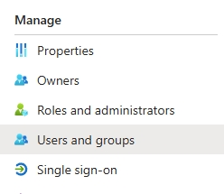

# SAML Authentication for Zabbix

## User Management

### User Group

I need a default user group that users will be placed in upon their initial login.

To create a group I went to `Users` ➥ `User groups`.


I then made a group for called Networking, who will have access to all network devices.


:::info[Command Explanation]

- `Group name` : I named it ‘Networking’.
- `Users` : I don’t have users so I left it blank.
- `Enabled` : Made sure to enable the group.

:::

Then I went to the `Template permissions` tab and clicked `Select`.


Here I chose `Template/Network devices`.


I then set `Permissions` to `Read-write` and clicked `Add`.

### User Role

I then needed to create a default role that will be given to users on their first sign-in.

I went to `Users` ➥ `User roles`.


I made the following permission changes.


:::info[Explanation]

- `Name` : User+, they will have a bit more access than a regular user.
- `User type` – Admin, otherwise it won’t let me make certain changes.
- `Data collection` – I deselected everything except Maintenace.

:::

Then scrolled down to `Access to actions` and selected `Manage scheduled reports` and `Manage SLA`.


When they log in, they will only see `Maintenance` under `Data Collection`.


## Azure AD

### Security Group

I only wanted people assigned to a certain security group to have access to Zabbix.

First, I logged in to the Entra Identity portal and went to Groups ➥ All groups.


I then clicked on `New Group`.


:::info[Explanation]

- `Group type` – Security
- `Group name` – Zabbix, so that it’s easily identifiable.
- `Membership type` – Assigned
- `Members` – I then assigned some users to the group.

:::

### Application

I now needed to create the application and link it to my Zabbix domain.

On the left-side menu I went to `Applications` ➥ `Enterprise applications`.


I clicked on `Create your own application` and selected `Integrate any other application you don’t find in the gallery`.


Then went to `Users and group`.



and added the Zabbix group I created earlier.


Next, I went to `Single sign-on`.


I selected SAML as the sign-on method.


I filled out the Basic SAML Configuration.

I then created the following Attributes & Claims.


The SAML Certificates section will be automatically populated. I just downloaded the certificate so that I can paste it’s contents into a new file within the Ubuntu server.


### Zabbix Server

I then created the new file within my Zabbix servers (if you’re using high availability you’ll need to create the cert on all servers, but not the database server), and pasted the contents of the certificate file.

```bash
nano /usr/share/zabbix/conf/certs/idp.cert
```

Then I changed the cert’s permissions.

```bash
sudo chmod 644 /usr/share/zabbix/conf/certs/idp.cert
```

I then edited the zabbix-conf.php file.

```bash
sudo nano /usr/share/zabbix/conf/zabbix.conf.php
```

I added the following 2 lines at the bottom of the file.

```bash
$SSO['IDP_CERT']                = 'conf/certs/idp.cert';
$SSO['SETTINGS']                = ['strict' => false, 'baseurl' => "https://<domain>/", 'user_proxy_headers' => true];
```

:::info[Command Explanation]

- `conf/certs/idp.cert` – This string specifies the path to the IdP’s certificate. This certificate is essential for securely validating the signatures on SAML assertions or similar security tokens provided by the IdP during the SSO process.
- `user_proxy_headers' => true` – This setting allows the application to trust proxy headers, such as X-Forwarded-For, which are used to determine the client’s original IP address when the application is behind a proxy. This can be important for applications deployed in environments where load balancers or reverse proxies handle incoming traffic.

:::

Next I edited the zabbix.conf file.

```bash
sudo nano /etc/nginx/conf.d/zabbix.conf
```

I changed the port to listen on 80, and I added the domain name.

```bash
server {
listen          80;
server_name     10.33.99.30 <domain>;
```

Then reloaded nginx.

```bash
sudo systemctl reload nginx
```

### Zabbix Frontend

Now to setup the frontend so users can login with SSO.

First, I went to `Users` ➥ `Authentication`.


On the Authentication tab I have to select a deprovisioned users group or else it won’t let me setup SAML.


The only option is `Disabled`.


For the next part I needed the URL’s provided at the `Set up Zabbix` section.


Onto the SAML settings tab.


:::info[Explanation]

- I enabled SAML authentication.
- I enabled JIT provisioning
- `IdP entity ID` – This is the ‘Microsoft Entra Identifier’.
- `SSO service URL` – This is the ‘Login URL’.
- `SLO service URL` – This is the ‘Logout URL’.
- `Username attribute` – This is the ‘Attributes & Claims’ I setup earlier, which is for user.givenname.
- `SP name ID format` – This is the ‘Identifier (Entity ID)’.
- I enabled ‘Configure JIT provisioning’.

:::

Then I scrolled down and configured the attributes.


:::info[Explanation]

- Group name attribute – The name has to match the user.groups attribute name.
- User name attribute – The name has to match the user.givenname attribute name.
- User last name attribute – The name has to match the user.surname attribute name.
- User group mapping
  - SAML group pattern – The name has to match the security group name setup in Entra Identity.
  - User groups – The group you want to assign them once they log into Zabbix.
  - User role – The role they will be assigned when they log into Zabbix.
- I enabled SCIM provisioning.

:::

Now if you go back to the login screen there will be a link for Sign in with Single Sign-On (SAML).


Finally, users can sign in using their Microsoft credentials. If you have 2FA setup, it’ll prompt them for their 2FA code as well.


