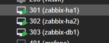
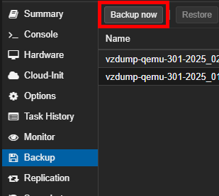
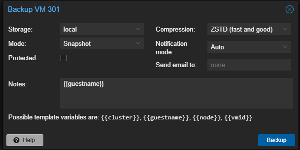
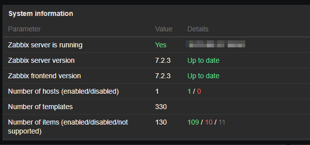

# 3. Upgrading HA Zabbix

Zabbix is a powerful open-source monitoring solution that can monitor various services, servers, and network devices. In this blog, I will show how I upgrade my cluster from version 7 to version 7.2, that way I have access to newer and better dashboard widgets.

## Backups

### Virtual Machines

I started off by making backups of my VM’s on Proxmox. That way I can easily roll back if something doesn’t end up working.

I selected the VM.



Then went to `Backup` ➥ `Backup now`.



Then clicked `Backup`. I did this for all 3 virtual machines.



### Zabbix-HA1 & HA2

I first logged into my first HA server and switched to root.

```bash
sudo -s
```

I then stopped the Zabbix server service.

```bash
systemctl stop zabbix-server
```

Then made a directory to store my backups.

```bash
mkdir /opt/zabbix-backup/
```

Then copied the zabbix_server.conf file into the backup directory.

```bash
cp /etc/zabbix/zabbix_server.conf /opt/zabbix-backup/
```

I also backed up the following directory.

```bash
cp -R /usr/share/zabbix/ /opt/zabbix-backup/
```

### Zabbix-DB1

I SSH’d into my database server and switched to root.

```bash
sudo -s
```

Then made a directory for my backups.

```bash
mkdir /zabbix-db-backups/
```

I then made a backup of my Zabbix database.

```bash
mysqldump -u root -p zabbix > /zabbix-db-backups/zabbix_backup_$(date +%F).sql
```

:::info[Command Explanation]

- `mysqldump` – This is the utility provided by MySQL for creating a database backup. It generates a file with SQL statements that can be used to recreate the database structure and data.
- `-u root` – Specifies the username with which to connect to the MySQL server, in this case, ‘root’. This user must have sufficient privileges to access the entire database.
- `-p` – Signals that mysqldump should prompt for the password of the MySQL user account. For security reasons, it’s a good practice not to directly include the password in the command line.
- `zabbix` – This is the name of the database to be dumped. Here, it refers to the Zabbix database, which typically contains configuration and operational data for the Zabbix monitoring system.
- `>` – This character is used to redirect the output from the command on the left (output of mysqldump) to the file specified on the right.
- `zabbix_back_$(date +%F).sql` – Defines the filename of the backup file. It uses shell command substitution $(date +%F) to insert the current date (formatted as YYYY-MM-DD) into the filename. This helps in organizing backups by date, making it easier to locate and manage them over time.

:::

Next, I logged into my MySql as root.

```bash
mysql -root
```

I then set the following variable to allow any users to create and/or modify functions.

```bash
SET GLOBAL log_bin_trust_function_creators = 1;
```

## Upgrade

### Zabbix-HA1

The upgrade process on HA1 is a bit different than HA2.

I first needed to edit the zabbix_server.conf file.

```bash
sudo nano /etc/zabbix/zabbix_server.conf
```

I then scrolled to the very bottom and commented the HANodeName line.

```bash
# HANodeName=Node1
```

Then I uninstalled my current Zabbix repository package.

```bash
rm -Rf /etc/apt/sources.list.d/zabbix.list
```

I then downloaded the latest package.

```bash
wget https://repo.zabbix.com/zabbix/7.2/release/ubuntu/pool/main/z/zabbix-release/zabbix-release_latest_7.2+ubuntu22.04_all.deb
```

I then installed the package.

```bash
dpkg -i zabbix-release_latest_7.2+ubuntu22.04_all.deb
```

I then updated the repository.

```bash
apt update
```

Next, I only upgraded the zabbix-server-mysql first.

```bash
apt install --only-upgrade zabbix-server-mysql
```

After it was done, I edited the zabbix_server.conf file.

```bash
sudo nano /etc/zabbix/zabbix_server.conf
```

Then uncommented HANodeName.

```bash
HANodeName=Node1
```

Then restarted the server.

```bash
shutdown -r now
```

After the reboot I upgraded the frontend, and Nginx conf file.

```bash
sudo apt install zabbix-frontend-php zabbix-nginx-conf
```

:::info[Note]

If you don’t upgrade the nginx-conf file you’ll just get the Nginx default page when accessing the domain/ip address.

:::

I now have to edit the nginx.conf file.

```bash
sudo nano /etc/zabbix/nginx.conf
```

Then added port 80, and my shared IP address and domain name.

```bash
# listen 8080;
# server_name example.com;

listen 80;
server_name 10.33.0.105 domain.com;
```

Then finally restarted Nginx keepalived.

```bash
sudo systemctl restart nginx keepalived
```

### Zabbix-HA2

Repeat the same steps, except commenting out HANodeName is not necessary.

### Zabbix-DB1

Back on the database server, I have to revert the earlier change to mariadb.

I logged in as root.

```bash
mysql -root
```

Then changed it from 1 to 0.

```bash
SET GLOBAL log_bin_trust_function_creators = 0;
```

Now when I logged in it shows my server and frontend versions are up to date.


